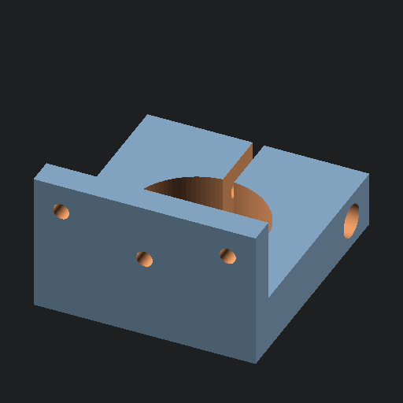

# Preview images

Generated by `generate_readme.sh` on Sat Sep  2 15:53:15 PDT 2023.

`cpe_with_lego/cpe_with_lego.scad`

`cpe_with_lego/cust_lego.scad`

`desktop_buttons/desktop_buttons.scad`

`grow_light_clip/light_clip.scad`

`kaypro_xt/powerswitch_mount.scad`

`lcd_with_protoboard_enclosure/lcd_with_protoboard.scad`

`library_test/gears.scad`

`library_test/mod_gears.scad`

`one_u_hook/one_u_hook.scad`

`optical_bench_lens_holder/lens_holder.scad`

`quarter_inch_tape_head_mount/qit_mount.scad`

`rascsi_with_hdd/rascsi_with_laptop_hdd.scad`

`rotating_media/Pulley_T-MXL-XL-HTD-GT2_N-tooth.scad`

`rotating_media/axle_adapter.scad`

`rotating_media/common.scad`

`rotating_media/copper_tube_adapter.scad`

`rotating_media/disc.scad`

`rotating_media/full_assembly.scad`

`rotating_media/head_mount.scad`

`rotating_media/head_positioner.scad`

`rotating_media/llve_axle_drum.scad`

`rotating_media/motor_clamp.scad`

`rotating_media/multipart_drum.scad`

`rotating_media/nortronics_adapter.scad`

`rotating_media/sm_head_mount.scad`

`rotating_media/stand.scad`

`rotating_media/stand_tie.scad`

`small_tool_organizer/small_tool_organizer.scad`

`tc560_control_handle/sony_tc-560d_control_handle.scad`

`telescope/surplus_optics_adapter.scad`

`watch_bezel/bezel.scad`

`z80_computer_case/z80_case.scad`

